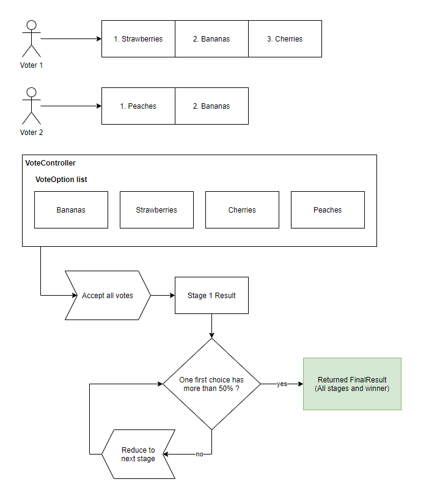

# ranked-voting-ts

This is a javascript library to facilitate [ranked choice voting](https://en.wikipedia.org/wiki/Ranked_voting). This is also sometimes called preferential voting. The specific flavor used here is [instant-runoff voting](https://en.wikipedia.org/wiki/Instant-runoff_voting).

## Why

My wife and I experimented with creating ranked choice voting functionality in Python and although it was coming along, we were using plain lists for everything and the code started to get a bit confusing and hard to read. I decided to brush up on Typescript and create a version of this functionality that has 100% unit test code coverage and uses strong types instead of raw arrays for everything. I'm not sure I can argue with total confidence that this version is actually more readable - it probably is - but either way it was a good opportunity to get some practice with Typescript.

## Npm Module Usage

In your node project, run `npm i ranked-voting`.

Example usage:

```JavaScript
import { UserVotes, VoteOption, VoteController } from 'ranked-voting'

const voteController = new VoteController([
  new VoteOption('spring'),
  new VoteOption('summer'),
  new VoteOption('fall'),
  new VoteOption('winter')
])

voteController.acceptUserVotes(new UserVotes(['spring', 'summer']))
voteController.acceptUserVotes(new UserVotes(['fall', 'spring']))
voteController.acceptUserVotes(new UserVotes(['fall', 'winter']))
voteController.acceptUserVotes(new UserVotes(['summer', 'spring']))
voteController.acceptUserVotes(new UserVotes(['summer', 'winter']))

const result = voteController.getFinalResult()

if (result.winner !== null) {
  console.log(`${result.winner} won after ${result.stageResults.length - 1} stages`)
} else {
  console.log(`tie between ${result.tieOptions.join(', ')}`)
}

```

If this were in a file called `index.js` you would run this with `node index.js` and should see output similar to `summer won after 2 stages`.

## Project Commands

| Command | Description |
|---|---|
| `npm install` | Installs dependencies |
| `npm run build` | Deletes dist/coverage directories and runs tsc |
| `npm run start` | Runs the sample usage in index.ts |
| `npm run watch` | Runs `tsc --watch` using project local Typescript |
| `npm run test` | Runs all Mocha unit tests |
| `npm run test:coverage` | Runs all Mocha unit tests and Istanbul test coverage |
| `npm run clean` | Deletes dist/coverage directories |

## Making Changes

After getting repo, run `npm install` and then `npm watch` and then start making changes. My personal preference is to have 2 terminals running on a second monitor, one with the watch command (which will show info about compilation errors when they exist) and one where I run `npm run test` or `npm run test:coverage` so I can run my individual changes granularly without needing to exercise the entire library.

When generating test coverage info, it is dumped in `./coverage/index.html` in addition to the CLI text output. The html output shows very detailed info, such as which lines of code are covered. Personally, I like to write my tests without coverage to cover the basics, then when I move to a polish phase I have the coverage report open in a browser and check it after making each change and re-running `npm test:coverage`. One way to test these individual unit test changes is to temporarily make `it()` methods `it.only()` - just don't forget to change them back.

## Ranked Choice Voting Logic

For detailed info see [ranked choice voting](https://en.wikipedia.org/wiki/Ranked_voting) and [instant-runoff voting](https://en.wikipedia.org/wiki/Instant-runoff_voting).

The basic idea is that we're eliminating candidates with the fewest first-choice votes until one candidate has more than 50% of first-choice votes.



At a high level this concept is extremely simple. There are situations where tie-breaker logic is required, and ultimately a real tie is possible, although the larger the voter population, the more unlikely a tie is.

**Tie conditions**:
- When attempting to find a winner, which means at any stage when all candidates have greater than 0 first choice votes and every candidate has exactly the same number of first choice votes
  - Example 1: 2 candidates each have 50% first choice votes, all other candidates have previously been eliminated
  - Example 2: 3 candidates each have exactly 1/3 first choice votes, all other candidates have previously been eliminated
- When attempting to eliminate a candidate with fewest first choice votes, there is a tie for "worst loser" - this scenario is actually irrelevant (explanation below)

**Tie-breaker logic**: run a scenario where you eliminate each tied candidate and tally how many first choice votes each candidate would get and total them across scenarios. If there's still an exact tie when evaluating the results/totals for these scenarios, and the set of tied candidates is all the remaining candidates with greater than 0 first choice votes, then it's an actual tie for the entire race. If the tie is between a subset of candidates then all remaining with greater than 0 first choice votes, then checking for ties for worst loser isn't actually required. In this scenario (subset of candidates tied for worst loser) you simply eliminate all candidates tied for worst loser.

## Decisions

### Compilation

I chose not to use ts-node in favor of letting Typescript do it all. The tiny delay ts-node adds to compilation probably isn't that big a deal, but for some reason it really bugs me.

### Unit Test Assertion Library

I've used `expect` before and thought it was fine, but wanted to try plain `assert`. It's cool to write expect statements that read like english sentences, but I also like plain asserts - it feels a little more concise to me.

### Public vs Private Logic/Helper Methods

I read some posts about only unit testing the public interface vs making all methods public and testing each smaller method individually and wanted to try someone's suggestion of splitting the logic out into another file/class so that the public interface methods are still isolated, but each of the logic methods is public and unit-testable. I have to say, it was very enjoyable to write very small methods and exercise only a single method with a unit test before moving on. At every step I had very high confidence and was able to refactor with ease knowing whether I was or wasn't breaking something, and exactly where and why, if so.

There are obvious smells here though. Like splitting logic for a class into a separate file in a large project would probably add confusion. We're also being pretty lazy about specifying what should or shouldn't be extended. Also, using these methods outside the context of the public interface class could potentially be very error prone. For example, my `sameOptions` method doesn't actually do deep array comparison, so it would fail if another class tried to use it in that way.

### Arrays vs Wrapper Classes

The whole point of this project was to try and write more readable/maintainable code, and replacing plain arrays with wrapper classes provides type checking and IDE support (intellisense, auto-complete, hints, etc). On the surface it probably feels like a model class like `UserVotes` that's just an array is obtuse, but in my opinion, the benefit outweighs the cost. This would be especially true as a project increases in size and complexity.
